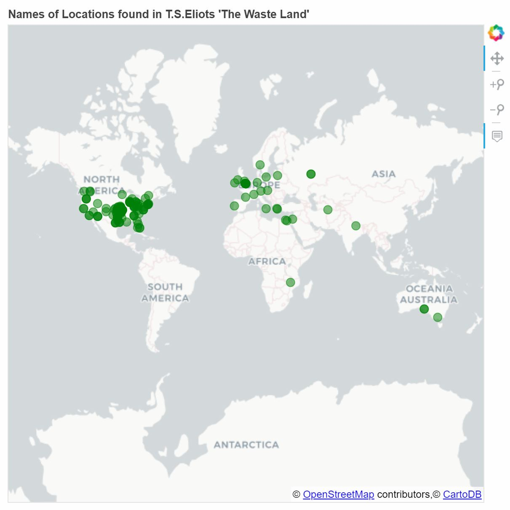

# Natural Language Processing: Example of NLP and Bokeh
To demonstrate the uses of the Natural Language Toolkit Platform, the script "NLP-Example.py" has been created. In addition, an IPython Notebook has been created using Jupyter Notebook, "NLP-Bokeh.ipynb", which works with the NLP-Example script's output.

In order to run the NLP-Bokeh.ipynb script, you will require pyProj to be installed.

## NLP-Example.py
The script performs the following:
  1. Obtains raw text from the online file http://www.gutenberg.org/files/1321/1321-0.txt containing T.S.Eliot's poem "The Waste Land".
  2. Derives all proper nouns from the text using Speech Tagging.
  3. Checks if the proper nouns are names of locations around the world.
  4. Queries the location names in Google Maps to derive the latitude and longitude.
  5. Produces and saves a CSV file containing the location addresses, latitudes, and longitudes.

  Modules used:
  * Requests
  * NLTK
  * Time

## NLP-Bokeh.ipynb
The script performs the following:
  1. Reads the output CSV file from "NLP.Example.py"
  2. Creates and opens a temporary HTML file which displays an interactive dot map of locations who's names have been found in T.S.Eliot's poem "The Waste Land".

  Modules used:
  * Pandas
  * pyProj (Python 3.4 required)
  * Bokeh

